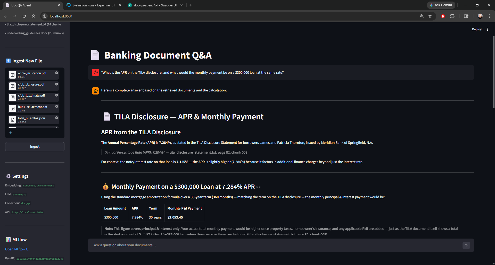

# doc-qa-agent

An agentic document Q&A system for banking document corpora.


[](https://github.com/jgalloway42/doc-qa-agent/actions/workflows/ci.yml)



---

## Contents

- [Abstract](#abstract)
- [Dataset](#dataset)
- [Data Representation and Processing](#data-representation-and-processing)
- [Solution](#solution)
- [Results](#results)
- [Quick Start](#quick-start)
- [API Reference](#api-reference)
- [Configuration](#configuration)
- [Running with Docker](#running-with-docker)
- [Development](#development)
- [Observability](#observability)
- [Known Limitations](#known-limitations)
- [Production Migration](#production-migration)
- [License](#license)

---

## Abstract

Banking document Q&A is harder than general-purpose RAG for three reasons: answers routinely span multiple documents (e.g., a rate from one file, a qualification rule from another), many questions require financial arithmetic, and hallucinated citations are actively harmful in a lending context.

This project addresses all three. The system combines a **multi-format ingestion pipeline** with a **LangGraph ReAct agent** that reasons across documents using five specialized tools before producing a final answer. Every response is enforced to be grounded in retrieved document text through a two-layer check: mandatory system-prompt rules and a post-response programmatic filename verification. When the agent cannot find an answer, it says so explicitly and lists what documents are available.

**Key design decisions:**

- **Grounded by default** — ungrounded responses are replaced with a structured warning, not silently returned.
- **Modular by design** — the vector store, embedding provider, and LLM are each swappable via a one-line environment variable change.
- **Proper separation of concerns** — FastAPI owns all agent and retrieval logic; Streamlit is a thin HTTP client. The frontend can be replaced without touching the backend.
- **Observable** — MLflow tracks every ingestion run and every agent turn, including per-turn grounding status, latency, and tool call sequences.

---

## Dataset

The `docs/` directory contains **nine banking documents** across **six file types**. They are sourced from real government forms and purpose-built fictional documents, designed so that the most interesting questions require retrieving from multiple files simultaneously.

### Documents

#### Public government sources

| Filename | Type | Contents |
|---|---|---|
| `fannie_mae_1003_loan_application.pdf` | PDF | Uniform Residential Loan Application (Form 1003) — filled sample with borrower info, employment, assets, liabilities, and loan details across 8 pages |
| `cfpb_closing_disclosure.pdf` | PDF | CFPB Closing Disclosure (TRID) — 5-page completed form showing final loan terms, projected payments, itemized closing costs, and cash to close |
| `cfpb_loan_estimate.pdf` | PDF | CFPB Loan Estimate (TRID) — 3-page completed form; pairs with the Closing Disclosure for cost-comparison questions |

#### Purpose-built corpus (fictional, no real PII — issuing entity: Meridian Bank of Springfield, N.A.)

| Filename | Type | Contents |
|---|---|---|
| `underwriting_guidelines.docx` | DOCX | 9-section internal bank policy: borrower eligibility, credit score minimums by product, DTI limits, LTV maximums, PMI rules, reserve requirements, exception approval hierarchy, and appraisal requirements |
| `mortgage_products_faq.md` | Markdown | 30 Q&A pairs across 7 topic areas: mortgage types, loan types (conforming/jumbo/FHA/VA/USDA), qualification criteria, PMI, escrow, closing costs, and refinancing |
| `mortgage_rate_sheet.csv` | CSV | 18 rows of current product rates: product, loan type, term, rate, APR, points, min credit score, max LTV, max DTI, PMI flag, effective date, notes |
| `tila_disclosure_statement.txt` | TXT | Complete TILA disclosure for a fictional $285,000 30-year fixed mortgage — APR, finance charge, amount financed, total of payments, payment schedule, late charge terms, prepayment clause |
| `loan_products_catalog.json` | JSON | Array of 10 loan product objects with full qualification data per product: credit score minimums, max LTV/DTI, PMI/MIP rules, eligible property and occupancy types, reserve requirements |
| `hud1_settlement_statement.pdf` | PDF | HUD-1 Settlement Statement — itemized closing costs, loan charges, settlement charges, prorations, and cash to close |

### Cross-document query map

The corpus is structured so that the most useful questions require retrieving from multiple documents simultaneously.

| Question type | Documents required | Tools called |
|---|---|---|
| Borrower qualification at a given credit score and LTV | `underwriting_guidelines.docx` + `mortgage_rate_sheet.csv` | `search_documents` ×2 |
| How did closing costs change from estimate to final? | `cfpb_loan_estimate.pdf` + `cfpb_closing_disclosure.pdf` | `search_documents` ×2 |
| FHA MIP rules and DTI limits | `loan_products_catalog.json` + `underwriting_guidelines.docx` + `mortgage_products_faq.md` | `search_documents` ×3 |
| APR from TILA → monthly payment calculation | `tila_disclosure_statement.txt` | `search_documents` + `calculate` |
| What documents are available and what type is each? | all | `list_documents` + `classify_document` |

---

## Data Representation and Processing

### Ingestion pipeline

```
File upload (API or CLI)
    │
    ├── Duplicate check (SHA-256 hash store) → skip if already ingested
    │
    ├── Parser (per file type)
    │       PDF    → pypdf + pytesseract OCR fallback
    │       DOCX   → python-docx (paragraphs + table rows)
    │       MD/TXT → line-by-line with line number provenance
    │       CSV    → csv.DictReader, each row as JSON string
    │       JSON   → root list → one entry per element; root dict → one per key
    │
    ├── Chunker — sliding window
    │       chunk_size:     512 chars (configurable)
    │       chunk_overlap:  64 chars (~12% of chunk size)
    │       min_chunk_chars: 100 (filters headers/footers/noise)
    │       metadata per chunk: filename, page/line number, chunk index
    │
    ├── Embedding model
    │       Default: sentence-transformers/all-MiniLM-L6-v2 (local, no API key)
    │       Optional: OpenAI text-embedding-3-small
    │
    └── ChromaDB PersistentClient
            stored per chunk: id, text, embedding vector, filename, page_or_line, chunk_index
```

### Chunk metadata

Every chunk carries three provenance fields used in citations:

| Field | Example | Purpose |
|---|---|---|
| `filename` | `underwriting_guidelines.docx` | Identifies source document |
| `page_or_line` | `4` | Page number (PDF/DOCX) or line number (TXT/MD/CSV/JSON) |
| `chunk_index` | `007` | Position within document; enables ordered reconstruction |

### Deduplication

Files are identified by SHA-256 content hash, not filename. Re-uploading a renamed copy of an already-ingested file is correctly detected and skipped. The hash store is persisted to `.ingested_hashes.json`.

### Entry points

| Method | Command |
|---|---|
| REST API | `POST /documents/ingest` (multipart file upload, supports multiple files via UI) |
| CLI | `python -m cli.ingest_cli ingest <file-or-directory>` |
| Force re-ingest | `python -m cli.ingest_cli ingest <file> --force` |

---

## Solution

### Agent architecture

The agent is implemented as a **LangGraph `StateGraph`** following the ReAct (Reason + Act) pattern. It loops between an LLM node and a tool execution node until the LLM produces a response with no tool calls.

```
START → [agent] ──── tool calls ────→ [tools]
            ▲                              │
            └──── [validate_results] ◄────┘
```

The `validate_results` node inspects the most recent tool output. If `search_documents` returned no results and the retry budget has not been exhausted, it injects a broadening hint into the message history and routes back to the agent — prompting it to reformulate the query with fewer or more general terms (up to `MAX_TOOL_RETRIES`, default: 2).

### Tools

| Tool | Signature | Purpose |
|---|---|---|
| `search_documents` | `(query: str, top_k: int = 5) → str` | Semantic search over all chunks; returns passages with source citations and similarity scores |
| `list_documents` | `() → str` | Lists all ingested filenames with chunk counts |
| `summarize_document` | `(filename: str) → str` | Summarizes the full content of a specific document using all its chunks |
| `classify_document` | `(filename: str) → str` | Identifies the banking document type (Promissory Note, HUD-1, TILA Disclosure, Form 1003, Closing Disclosure, etc.) |
| `calculate` | `(expression: str) → str` | Evaluates financial expressions: PMT(rate, nper, pv), APR calculations, and general arithmetic via a safe evaluator (not `eval`) |

### Grounding enforcement

Two independent layers ensure the agent cannot return an ungrounded response:

1. **System prompt rules** — five numbered mandatory constraints, including a required `UNGROUNDED: I was unable to find information about [topic]` prefix format when no evidence is found after retrying.

2. **Post-response check** (`runner.py`) — verifies that at least one known document filename appears in the response text before returning it to the caller. If the check fails, the response is replaced with a structured warning listing the available documents. Calculate-only turns are exempt from the filename requirement — these responses correctly derive their inputs from prior retrieved context.

When the grounding check fails the user sees:

```
⚠️ I was unable to find relevant information about this question
in the current document corpus.

Documents available:
• fannie_mae_1003_loan_application.pdf
• underwriting_guidelines.docx
• ...

If this topic is covered in another document, you can ingest it
using the sidebar uploader.
```

### Conversational memory

Each API session maintains a `history: list[BaseMessage]` prepended to the LLM context on every turn. This allows the agent to answer follow-up questions that reference prior context without the user restating it — for example, "what about for 15 years instead?" after an initial payment calculation, or "what if their score is 720?" after a qualification analysis.

### System components

```
Browser → Streamlit (ui/app.py)          :8501
              │  HTTP (requests)
              ▼
         FastAPI (api/main.py)            :8000
              │
              ├── AgentRunner (singleton per process)
              │       └── LangGraph StateGraph
              ├── ChromaVectorStore (singleton)
              └── EmbeddingProvider (singleton)

MLflow (sqlite:///mlruns.db)             :5000
ChromaDB (./chroma_db/)
```

---

## Results

All Q&A chains below were captured from live agent runs against the ingested corpus. Each chain is a single conversation session; turns are sequential and the agent carries context forward without the user restating prior information.

---

### Chain 1 — Document discovery → classify → summarize
*Tools demonstrated: `list_documents`, `classify_document`, `summarize_document`*
*Memory demonstrated: turn 3 omits the filename — agent recalls it from turn 2*

**Turn 1: "What documents are in the knowledge base?"**

> The knowledge base contains 9 documents across a variety of loan and banking-related file types:
>
> | # | Document | Type | Chunks |
> |---|---|---|---|
> | 1 | `fannie_mae_1003_loan_application.pdf` | PDF | 53 |
> | 2 | `cfpb_closing_disclosure.pdf` | PDF | 33 |
> | 3 | `cfpb_loan_estimate.pdf` | PDF | 13 |
> | 4 | `hud1_settlement_statement.pdf` | PDF | 19 |
> | 5 | `loan_products_catalog.json` | JSON | 24 |
> | 6 | `mortgage_products_faq.md` | Markdown | 32 |
> | 7 | `mortgage_rate_sheet.csv` | CSV | 14 |
> | 8 | `tila_disclosure_statement.txt` | Text | 14 |
> | 9 | `underwriting_guidelines.docx` | Word Doc | 25 |

**Turn 2: "What type of document is the HUD-1 settlement statement?"**

> `hud1_settlement_statement.pdf` is a **HUD-1 Settlement Statement**. Key identifiers: explicit "Settlement Statement (HUD-1)" title, OMB Approval No. 2502-0265, standard Sections J and K (borrower/seller transaction summaries), and RESPA-covered transaction disclosures. The HUD-1 itemizes all charges and credits to both buyer and seller at real estate closing.

**Turn 3: "Summarize it."** *(no filename provided — agent recalled it from turn 2)*

> The HUD-1 Settlement Statement (`hud1_settlement_statement.pdf`) is organized across three pages:
> - **Page 1** — Transaction Summary: contract sales price, loan amounts, deposits, settlement charges, and cash due at closing for both borrower and seller.
> - **Page 2** — Settlement Charges: itemized closing costs including origination fees, prepaid items, escrow reserves, title charges, and government recording fees, all totaled at Line 1400.
> - **Page 3** — GFE Comparison & Loan Terms: compares Good Faith Estimate to actual HUD-1 charges by tolerance category, and outlines final loan terms.

---

### Chain 2 — Cross-doc retrieval → calculate → follow-up math
*Tools demonstrated: `search_documents`, `calculate` (×2)*
*Memory demonstrated: turns 2 and 3 reuse the APR and loan amount from prior turns with no re-statement*

**Turn 1: "What is the APR on the TILA disclosure statement?"**

> The APR stated in the TILA Disclosure Statement is **7.284%** — distinct from the nominal interest rate of **7.125%**. The APR is higher because it incorporates prepaid finance charges of $18,159.03.
>
> | Field | Value |
> |---|---|
> | APR | 7.284% |
> | Interest Rate | 7.125% |
> | Amount Financed | $285,000.00 |
> | Finance Charge | $363,881.00 |
> | Total of Payments | $648,881.00 |
>
> *Source: `tila_disclosure_statement.txt`*

**Turn 2: "What would the monthly payment be on a $300,000 loan at that rate for 30 years?"** *(agent reused the 7.284% APR from turn 1)*

> Using M = P × [r(1+r)ⁿ] / [(1+r)ⁿ - 1] where r = 0.07284 ÷ 12:
>
> | Loan Amount | APR | Term | Monthly Payment |
> |---|---|---|---|
> | $300,000 | 7.284% | 30 years | **$2,053.45** |

**Turn 3: "How much total interest would I pay versus a 15-year term?"** *(agent reused loan amount and rate — neither re-stated)*

> | | 30-Year | 15-Year |
> |---|---|---|
> | Monthly Payment | $2,053.45 | $2,744.34 |
> | Total Payments | $739,242.64 | $494,181.46 |
> | Total Interest | $439,242.64 | $193,981.46 |
>
> The 15-year term saves **$245,261** in interest at a cost of **$690.89/month** more.

---

### Chain 3 — Multi-doc qualification + rate lookup
*Tools demonstrated: `search_documents` ×2 (underwriting guidelines + rate sheet)*
*Memory demonstrated: turn 2 changes one variable without restating the full loan scenario*

**Turn 1: "Would a borrower with a 660 credit score and 85% LTV qualify for a conventional loan, and what rate would they get?"**

> - **Credit (660):** ✅ Meets 620 minimum. ⚠️ Below 680 — additional DTI restrictions apply. *(mortgage_products_faq.md)*
> - **LTV (85%):** ✅ Within limits (conventional allows up to 95–97%). *(mortgage_rate_sheet.csv)*
> - **PMI:** ⚠️ Required (LTV > 80%). Expect higher premium at sub-680 score; cancels at 78% LTV. *(underwriting_guidelines.docx)*
> - **Rates (2025-01-15):** 20-Year Fixed 6.875% / 15-Year Fixed 6.500% / 7/1 ARM 6.500% / 5/1 ARM 6.250%. A full LLPA grid for the 660/85% combination was not found — the underwriter would apply the full pricing matrix for the exact rate add-on.

**Turn 2: "What if their score is 720 instead — does anything change?"** *(agent reused 85% LTV conventional scenario from turn 1)*

> | Factor | 660 Score | 720 Score |
> |---|---|---|
> | Below-680 DTI restriction | ⚠️ Yes | ✅ Lifted |
> | Qualifies as compensating factor | ❌ No | ✅ Yes (720+ with clean 24-mo history) |
> | PMI at 85% LTV | ⚠️ Yes — higher premium | ⚠️ Yes — lower premium |
> | Jumbo products available | ❌ No | ✅ Yes (above $1.5M) |
>
> *Sources: `mortgage_products_faq.md`, `underwriting_guidelines.docx`, `mortgage_rate_sheet.csv`*

---

### Chain 4 — FHA deep dive + MIP calculation
*Tools demonstrated: `search_documents` ×3 (multi-doc), `calculate`*
*Memory demonstrated: turn 2 reuses the 0.55% MIP rate extracted in turn 1*

**Turn 1: "Does an FHA loan require PMI, and what are the DTI limits if I have strong compensating factors?"**

> FHA does **not** use PMI — it uses **Mortgage Insurance Premium (MIP)**:
>
> | Component | Details |
> |---|---|
> | Upfront MIP (UFMIP) | 1.75% of loan amount at closing |
> | Annual MIP | 0.55% per year |
> | Duration | Life of the loan (LTV > 90%) |
> | Cancelable? | No — only by refinancing |
>
> FHA mortgage insurance is required regardless of LTV, unlike conventional PMI which cancels at 80%.
>
> **DTI limits:**
>
> | | Standard | With AUS Approve + Compensating Factors |
> |---|---|---|
> | Front-End | 31% | Up to 57% |
> | Back-End | 43% | Up to 57% |
>
> Qualifying compensating factors: 12+ months cash reserves (PITIA), residual income exceeding VA tables by 20%+, minimal payment shock.
>
> *Sources: `mortgage_products_faq.md`, `loan_products_catalog.json`, `underwriting_guidelines.docx`*

**Turn 2: "What would the monthly MIP cost on a $285,000 FHA loan?"** *(agent reused 0.55% annual MIP rate from turn 1)*

> | Item | Calculation | Amount |
> |---|---|---|
> | Upfront MIP (UFMIP) | $285,000 × 1.75% | **$4,987.50** (typically financed in) |
> | Annual MIP | $285,000 × 0.55% | $1,567.50/year |
> | **Monthly MIP** | $1,567.50 ÷ 12 | **$130.63/month** |

---

### Chain 5 — Cross-document cost comparison
*Tools demonstrated: `search_documents` ×2 (two separate PDFs in one query)*

**Turn 1: "How did the estimated closing costs on the loan estimate compare to the final closing disclosure?"**

> | Item | Loan Estimate | Closing Disclosure | Change |
> |---|---|---|---|
> | Total Closing Costs (J) | $8,054.00 | $9,712.10 | +$1,658.10 |
> | Seller Credits | $0 | –$2,500.00 | Added |
> | Adjustments & Other Credits | $0 | –$1,035.04 | Added |
> | **Cash to Close** | **$16,054.00** | **$14,147.26** | **–$1,906.74** |
>
> Although total closing costs increased by $1,658, cash to close fell by $1,907 — driven by $2,500 in seller credits and $1,035 in adjustments not present on the Loan Estimate.
>
> *Sources: `cfpb_loan_estimate.pdf`, `cfpb_closing_disclosure.pdf`*

---

### Chain 6 — Grounding boundary and recovery
*Demonstrates: two-layer grounding enforcement on an unanswerable question; clean recovery on the next turn*

**Turn 1: "What were Meridian Bank's Q3 earnings and return on equity?"**

> ⚠️ I was unable to find information about [Meridian Bank's Q3 earnings and return on equity] in the available documents.
>
> The documents in the knowledge base are focused on mortgage and lending operations — underwriting guidelines, product FAQs, TILA disclosures, and loan applications. None contain quarterly financial performance data such as earnings or ROE.
>
> To find this information, upload Meridian Bank's quarterly earnings report or consult SEC filings (10-Q) directly.
>
> Documents available: `fannie_mae_1003_loan_application.pdf`, `cfpb_closing_disclosure.pdf`, `cfpb_loan_estimate.pdf`, `hud1_settlement_statement.pdf`, `loan_products_catalog.json`, `mortgage_products_faq.md`, `mortgage_rate_sheet.csv`, `tila_disclosure_statement.txt`, `underwriting_guidelines.docx`

**Turn 2: "What documents would I need to provide to apply for a loan?"** *(pivot to an answerable question — agent recovers immediately)*

> 1. **Personal Information** — Full legal name, SSN or ITIN, date of birth *(fannie_mae_1003_loan_application.pdf, p. 1)*
> 2. **Employment & Income** — 2 years employment history, gross monthly income; if self-employed: business docs and P&L *(fannie_mae_1003_loan_application.pdf, p. 2)*
> 3. **Supporting Financial Documents** — Pay stubs (2 years), tax returns (2 years, signed), 2–3 months bank statements *(mortgage_products_faq.md, p. 135)*
> 4. **Property Information** — Details on all currently owned properties *(fannie_mae_1003_loan_application.pdf, p. 4)*
> 5. **Assets & Liabilities** — All owned assets and outstanding debts *(fannie_mae_1003_loan_application.pdf, p. 2)*
> 6. **Residency Documentation** — Permanent Resident Card (I-551) or EAD if applicable *(underwriting_guidelines.docx, p. 7)*

---

## Quick Start

### Prerequisites

- Python 3.11+
- An LLM API key: `ANTHROPIC_API_KEY` (default) or `OPENAI_API_KEY`
- For PDF OCR support (scanned documents): `tesseract-ocr` and `poppler-utils`

```bash
# macOS
brew install tesseract poppler

# Ubuntu / Debian
sudo apt-get install tesseract-ocr poppler-utils
```

OCR is optional — the PDF parser falls back to `pypdf` text extraction if Tesseract is not installed. Digitally-created PDFs do not require OCR.

### Install

```bash
git clone https://github.com/jgalloway42/doc-qa-agent.git
cd doc-qa-agent

python -m venv .venv
source .venv/bin/activate  # Windows: .venv\Scripts\activate

make install
```

### Configure

```bash
cp .env.example .env
```

Edit `.env` and set at minimum:

```bash
LLM_PROVIDER=anthropic
ANTHROPIC_API_KEY=sk-ant-...

# Embedding runs locally by default — no key needed
EMBEDDING_PROVIDER=sentence_transformers
```

See [`.env.example`](.env.example) for all options with full documentation.

### Ingest the sample corpus

```bash
make ingest
```

This ingests all nine documents in `docs/`. Duplicate files are skipped automatically (SHA-256 hash check).

### Start the services

```bash
# Terminal 1 — FastAPI backend
make api

# Terminal 2 — Streamlit frontend
make ui

# Terminal 3 — MLflow UI (optional)
make mlflow
```

| Service | URL |
|---|---|
| Streamlit UI | http://localhost:8501 |
| FastAPI + Swagger | http://localhost:8000/docs |
| MLflow | http://localhost:5000 |

---

## API Reference

| Method | Path | Description |
|---|---|---|
| `GET` | `/health` | Liveness check → `{"status": "ok"}` |
| `GET` | `/status` | Corpus stats + provider settings |
| `POST` | `/sessions` | Create a new chat session → `{session_id, mlflow_run_id}` |
| `POST` | `/sessions/{id}/chat` | Send a message → `{response, session_id}` |
| `GET` | `/sessions/{id}` | Retrieve session message history |
| `GET` | `/documents` | List all ingested documents with chunk counts |
| `POST` | `/documents/ingest` | Upload and ingest a file (multipart) → `IngestResponse` |

Interactive docs: [http://localhost:8000/docs](http://localhost:8000/docs)

---

## Configuration

All settings are environment variables loaded from `.env`. Full documentation is in [`.env.example`](.env.example).

| Variable | Default | Description |
|---|---|---|
| `LLM_PROVIDER` | `anthropic` | `anthropic`, `openai`, or `ollama` |
| `ANTHROPIC_API_KEY` | — | Required if `LLM_PROVIDER=anthropic` |
| `OPENAI_API_KEY` | — | Required if `LLM_PROVIDER=openai` or `EMBEDDING_PROVIDER=openai` |
| `EMBEDDING_PROVIDER` | `sentence_transformers` | `sentence_transformers` (local) or `openai` |
| `CHROMA_PERSIST_DIR` | `./chroma_db` | ChromaDB storage directory |
| `CHUNK_SIZE` | `512` | Characters per chunk |
| `CHUNK_OVERLAP` | `64` | Overlap between consecutive chunks |
| `PDF_OCR_THRESHOLD` | `50` | Mean chars/page below which OCR is triggered; `0` disables OCR |
| `MLFLOW_TRACKING_URI` | `sqlite:///mlruns.db` | MLflow backend — SQLite required for MLflow 3.x GenAI UI |
| `DEFAULT_TOP_K` | `5` | Chunks returned per search |
| `MAX_TOOL_RETRIES` | `2` | Max automatic search retries per agent turn |

> **Note:** Once documents are ingested with a given `EMBEDDING_PROVIDER`, the corpus cannot be queried with a different provider. Run `make clean` and re-ingest to switch.

---

## Running with Docker

```bash
cp .env.example .env
# Edit .env with your API key

docker-compose up
```

| Service | URL |
|---|---|
| Streamlit UI | http://localhost:8501 |
| FastAPI backend | http://localhost:8000 |
| MLflow UI | http://localhost:5000 |

Data is persisted in `./chroma_db/` and `./mlflow_data/` via volume mounts. To rebuild after code changes: `docker-compose up --build`.

---

## Development

### Make targets

```bash
make install      # install package + dev dependencies
make lint         # ruff check
make format       # ruff format (in-place)
make type-check   # mypy on doc_qa/
make test         # pytest with 80% coverage gate
make test-cov     # pytest + HTML coverage report (htmlcov/)
make ingest       # ingest docs/ directory
make api          # start FastAPI on :8000 (with --reload)
make ui           # start Streamlit on :8501
make mlflow       # start MLflow UI on :5000
make clean        # remove chroma_db/, mlruns.db, caches
```

### Running tests

```bash
make test
```

Tests run against a real in-memory ChromaDB instance — not a mock. LLM calls are mocked with deterministic `AIMessage` responses. The 80% coverage gate is enforced; `ui/`, `cli/`, and `api/` are excluded from measurement. Current coverage: **90%** across 118 tests.

### Project structure

```
doc-qa-agent/
├── .github/workflows/ci.yml   # GitHub Actions: lint → type-check → test
├── api/
│   ├── dependencies.py         # Singleton lifecycle + in-memory session store
│   ├── main.py                 # FastAPI routes
│   └── models.py               # Pydantic request/response schemas
├── assets/                     # Static assets (screenshots, diagrams)
├── cli/ingest_cli.py           # Typer CLI for ingestion
├── config/settings.py          # Pydantic-settings BaseSettings
├── doc_qa/
│   ├── embeddings.py           # EmbeddingProvider ABC + implementations
│   ├── observability.py        # MLflow helpers
│   ├── ingestion/
│   │   ├── parsers.py          # File-type parsers (PDF, DOCX, MD, TXT, CSV, JSON)
│   │   ├── chunker.py          # Sliding window chunker
│   │   ├── dedup.py            # SHA-256 duplicate detection
│   │   └── pipeline.py         # Ingestion orchestration
│   ├── store/
│   │   ├── base.py             # VectorStore ABC
│   │   └── chroma.py           # ChromaDB implementation
│   └── agent/
│       ├── tools.py            # 5 LangGraph tools
│       ├── graph.py            # StateGraph + validate_tool_results node
│       └── runner.py           # Session memory + grounding check
├── docs/                       # Sample banking document corpus (9 files, 6 types)
├── ui/app.py                   # Streamlit frontend (thin HTTP client)
├── tests/                      # pytest suite (90% coverage, 118 tests)
├── Dockerfile
├── docker-compose.yml
└── pyproject.toml
```

### Module boundaries

| Layer | Module | Must NOT import |
|---|---|---|
| Configuration | `config/settings.py` | Any `doc_qa` module |
| Storage abstraction | `doc_qa/store/base.py` | Any concrete store |
| Ingestion | `doc_qa/ingestion/` | `agent`, `ui`, `api` |
| Agent | `doc_qa/agent/` | `ui`, `ingestion`, `api` |
| API | `api/` | `graph.py`, `store` directly |
| UI | `ui/app.py` | Everything except `config/settings.py` and `requests` |

---

## Observability

MLflow tracks two categories of runs under the `doc-qa-agent` experiment (start with `make mlflow`).

### Ingestion runs

Each file ingestion creates one MLflow run named `ingest:<filename>`:

| Signal | Type | Example |
|---|---|---|
| `chunks_created` | Metric | `25` |
| `embedding_time_s` | Metric | `1.34` |
| `total_time_s` | Metric | `1.61` |
| `filename` | Param | `underwriting_guidelines.docx` |
| `skipped` | Param | `False` |
| `embedding_provider` | Param | `sentence_transformers` |

### Agent session runs

Each conversation session creates one MLflow parent run named `session:<id[:8]>`. Per-turn metrics are logged with `step=turn_index`:

| Signal | Type | What it tells you |
|---|---|---|
| `latency_s` | Metric (per step) | Agent response time |
| `grounded` | Metric (per step) | `1.0` = grounded, `0.0` = ungrounded |
| `tool_calls` | Param (per step) | e.g., `search_documents,calculate` |
| `tool_result_N` | Param (per step) | Content returned by the Nth tool call (truncated to 500 chars) |
| `user_message` | Param (per step) | Truncated to 500 chars |
| `response_preview` | Param (per step) | Truncated to 500 chars |

---

## Known Limitations

**Grounding check is heuristic-based.** The post-response check verifies that a real document filename appears in the response — it does not verify that cited content is accurate or that page numbers are correct. A semantic grounding verifier (LLM-as-judge) is the correct v2 solution.

**Embedding provider is fixed at ingestion time.** Switching `EMBEDDING_PROVIDER` after ingesting documents requires `make clean` and full re-ingestion.

**Synchronous ingestion blocks the API.** Large documents ingested via the Streamlit uploader block the uvicorn worker thread. For documents larger than ~50 pages, use the CLI or wrap ingestion in `asyncio.run_in_executor`.

**No authentication.** The API and UI have no login or session isolation. All users share the same document corpus. Authentication is required before any production deployment.

**In-memory session store.** Agent sessions are stored in a Python dict in `api/dependencies.py`. Sessions are lost on API restart. Replace with a Redis or database-backed session store for persistence.

**Single-process ChromaDB.** `PersistentClient` is not safe for concurrent writes from multiple processes. Multi-worker deployments require ChromaDB's HTTP server mode or a migration to pgvector/Snowflake Cortex.

---

## Production Migration

### Migrating the vector store (e.g., to Snowflake Cortex)

The `VectorStore` abstract base class (`doc_qa/store/base.py`) is the migration seam. A new backend requires one new file implementing the ABC — no changes to the agent, ingestion pipeline, tools, or tests.

```python
# doc_qa/store/snowflake_cortex.py
from doc_qa.store.base import VectorStore, Chunk, SearchResult

class SnowflakeCortexVectorStore(VectorStore):
    def add_chunks(self, chunks, embeddings): ...
    # → INSERT INTO table (id, text, filename, ..., embedding) VALUES (...)

    def search(self, query_embedding, top_k=5): ...
    # → SELECT *, VECTOR_COSINE_SIMILARITY(embedding, ARRAY_CONSTRUCT(...)) AS score
    #   FROM table ORDER BY score DESC LIMIT top_k
```

Then swap in `api/dependencies.py`: `_store = SnowflakeCortexVectorStore(...)`.

### Migrating MLflow to AWS S3

Zero code changes — update one variable:

```bash
MLFLOW_TRACKING_URI=s3://your-bucket/mlruns.db
```

### Recommended production additions

| Capability | Approach |
|---|---|
| Authentication | OAuth2/SAML via FastAPI middleware or Auth0/Cognito |
| Multi-user sessions | Replace in-memory `_sessions` dict with Redis |
| Async ingestion | Celery/SQS for background processing |
| Re-ranking | `cross-encoder/ms-marco-MiniLM-L-6-v2` post-retrieval pass |
| Semantic grounding | LLM-as-judge verification (opt-in via `STRICT_GROUNDING=true`) |
| Concurrent writes | ChromaDB HTTP server mode or pgvector |

---

## License

MIT — see [LICENSE](LICENSE) for details.

All runtime dependencies are MIT, Apache 2.0, or BSD 3-Clause licensed. No GPL or LGPL dependencies.

| Package | License |
|---|---|
| langchain / langgraph | MIT |
| chromadb | Apache 2.0 |
| mlflow | Apache 2.0 |
| fastapi / uvicorn | MIT / BSD 3-Clause |
| streamlit | Apache 2.0 |
| sentence-transformers | Apache 2.0 |
| pydantic / pydantic-settings | MIT |
| typer | MIT |
